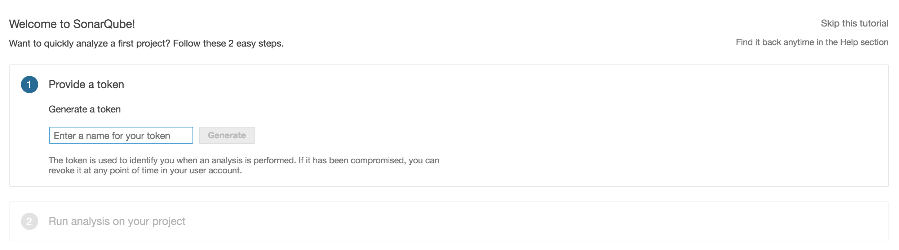

# Exercise 1 - Explore Lab Environment

## Explore OpenShift Environment

A) Navigate to the OpenShift Console: <{{ ocp_console_url }}> <a href="#0">

   * Username: `student-{{ student_number }}` 
   * Password: `{{ student_pwd }}` 
 
     >Note: Click on the **Advanced** button and click on the link: **Proceed to ocpws.kee.vizuri.com (unsafe)**
    
B) You have four projects pre-created for you (*Under My Projects on the right*)

* CICD - Tools needed for CICD Pipeline
    * anchore - Container Scanning Service
    * anchoredb - Database for Anchore Container Scanning Service
    * jenkins - Jenkins
    * nexus - Nexus artifact reposigory
    * sonarqube - Code Quality Service
    * sonardb - Database for Code Quality Service
    
* Customer Development - Development Project
    * customerdb - Mongo Database for Development Service
    
* Customer Test - Test Project
    * customerdb - Mongo Database for Test Service
    
* Customer Prod - Production Project
    * customerdb - Mongo Database for Production Service

## Explore Jenkins

A) Confirm you can log into your jenkins console: <http://jenkins-student-{{ student_number }}-cicd.{{ ocp_app_suffix }}> 

   * Username: `student-{{ student_number }}` 
   * Password: `{{ student_pwd }}` 

     >Note: Click on the **Allow selected permissions** button the first time:  

B) Should see the message: 

## Explore Nexus

A) Confirm you can navigate to nexus: <http://nexus-student-{{ student_number }}-cicd.{{ ocp_app_suffix }}> 

B) Should see the message: 

## Explore Quay Registry 

A) Confirm you can log into the Quay Container Registry: <https://quay.{{ ocp_app_suffix }}/repository> 

   * Username: `student-{{ student_number }}` 
   * Password: `{{ student_pwd }}` 

     >Note: Click on the **Advanced** button and click on the link: **Proceed to quay.apps.ocpws.kee.vizuri.com (unsafe)**

     >Note: If asked, you may have to confirm your username. So please click on the *Confirm Username* button when prompted
    
    
     
    
## Explore SonarQube

A) Confirm you can log into the sonarqube console: <http://sonarqube-student-{{ student_number }}-cicd.{{ ocp_app_suffix }}> 

   * Username: `admin` 
   * Password: `admin`

   >Note: If you are prompted to enter a token just click on *Skip this tutorial* in the top right. 
   
   
    
    
B) Should see the page: 

## Explore Gogs (git repositories) 

A) Confirm you can log into the gogs git server: <http://gogs.{{ ocp_app_suffix }}> 

   * Username: `student-{{ student_number }}` 
   * Password: `{{ student_pwd }}` 

B) You have one repository that we will use for the labs:

   * customer-service - SpringBoot REST Web Service utilized as demo project to orchestrate through our CI/CD process.
