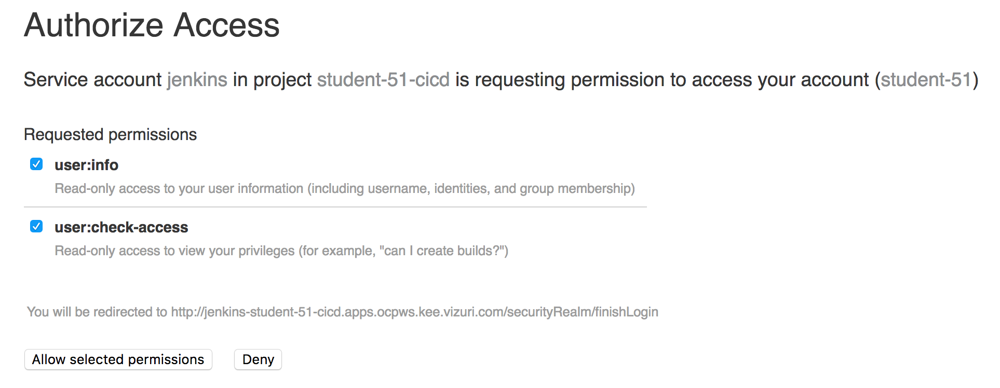
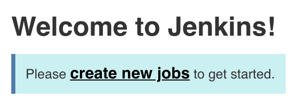
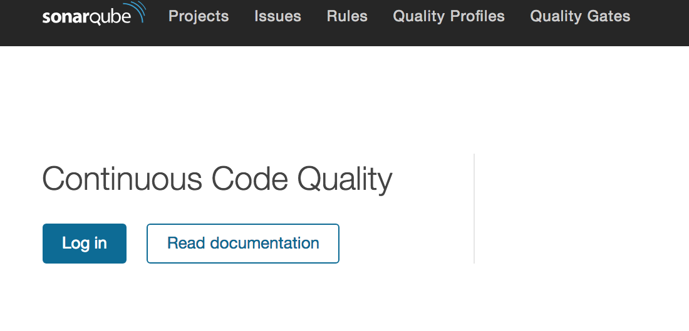

# Exercise 1 - Explore Lab Environment

## Explore OpenShift Environment

Navigate to the OpenShift Console

<{{ ocp_console_url }}> <button onclick="copyToClipboard('{{ ocp_console_url }}')">Copy URL</button>

* Username: student-{{ student_number }} 
* Password: {{ student_pwd }}

    >Note: Click on the **Advanced** button and click on the link: **Proceed to ocpws.kee.vizuri.com (unsafe)**
    
You have four projects pre-created for you (*Under My Projects on the right*)

* CICD - Tools needed for CICD Pipeline
    * anchore - Container Scanning Service
    * anchoredb - Database for Anchore Container Scanning Service
    * jenkins - Jenkins
    * nexus - Nexus artifact reposigory
    * sonarqube - Code Quality Service
    * sonardb - Database for Code Quality Service
* Customer Development - Development Project
    * customerdb - Mongo Database for Development Service
* Customer Test - Test Project
    * customerdb - Mongo Database for Test Service
* Customer Prod - Production Project
    * customerdb - Mongo Database for Production Service

## Explore Jenkins

Confirm you can log into your jenkins console.  

<http://jenkins-student-{{ student_number }}-cicd.{{ ocp_app_suffix }}>

* Username: student-{{ student_number }}
* Password: {{ student_pwd }}

    >Note: Click on the **Allow selected permissions** button the first time:  

Should see the message: 

## Explore Nexus

Confirm you can navigate to nexus.

<http://nexus-student-{{ student_number }}-cicd.{{ ocp_app_suffix }}>

Should see the message: 

## Explore Quay Registry 

Confirm you can log into the Quay Container Registry

<https://quay.{{ ocp_app_suffix }}/repository>

* Username: student-{{ student_number }}
* Password: {{ student_pwd }}

    >Note: Click on the **Advanced** button and click on the link: **Proceed to quay.apps.ocpws.kee.vizuri.com (unsafe)**

## Explore SonarQube

Confirm you can log into the sonarqube console

<http://sonarqube-student-{{ student_number }}-cicd.{{ ocp_app_suffix }}>

* Username: admin
* Password: admin

Should see the page: 

## Explore Gogs (git repositories) 

Confirm you can log into the gogs git server.

<http://gogs.{{ ocp_app_suffix }}>

* Username: student-{{ student_number }}
* Password: {{ student_pwd }}

You have one repository that we will use for the labs.

### Repositories:
* customer-service - SpringBoot REST Web Service utilized as demo project to orchestrate through our CI/CD process.
