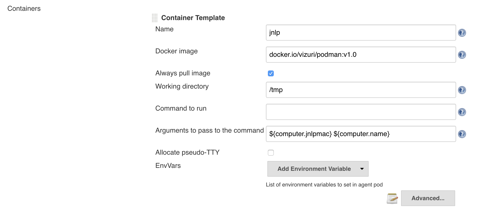

# Exercise 2 - Configure Jenkins Plugins

## Install Jenkins Plugins
In *[Jenkins](<http://jenkins-student-{{ student_number }}-cicd.{{ ocp_app_suffix }}> "Jenkins")*, navigate to *Manage Jenkins*.  

    Scroll down and choose Manage Plugins.  
    Choose the *Available* tab.

Install the following Plugins by selecting the checkbox: (*Use the filter on the top right to find the plugins*)
   * Anchore Container Image Scanner (under Build Tools)
   * Sonar Quality Gates
   * SonarQube Scanner
   * xUnit
   * Gogs

Click on the button *Install without Restart* at the bottom of the page.

## Configure Kubernetes Cloud
The Kubernetes Cloud plugin allows for the running of Kubernetes/OpenShift PODs as Jenkins JNLP Slaves

The OpenShift Jenkins deployment provides a Kubernetes Cloud setup.
It has two out-of-the-box Kubernetes Pod Templates for Jenkins jobs; maven and nodejs.  

We will be using podman to build our containers and pushing them to our container registry.  

An image has already been build for this container.  It can be found at:

<https://docker.io/vizuri/podman:v1.0>

If you would like to see the Dockerfile it can be found here:

<https://github.com/Vizuri/openshift-cicd-podman-jenkins-slave>

This container extends the OpenShift Maven image and just adds the podman binary. 

In Jenkins, navigate to the Manage Jenkins 

 * Scroll down to *Configure System*
 * Scroll down to the Cloud->Kubernetes section.  
 * Notice the provided configurations.  
 * Add our Podman Kubernetes Pod Template by clicking on the *Add Pod Template* button at the bottom of the page and choose *Kubernetes Pod Template*.
 * Enter the following values:
    
    * Name: maven-podman 
    * Labels maven-podman

    

 * Click on the *Add Container* button and choose *Container Template*.
 * Enter the following values:

    * Name: ```jnlp```
    * Docker Image: ```docker.io/vizuri/podman:v1.0```
    * Working directory: ```/tmp```
    * Command to run:   
        >*Note: Clear Out The Contents of this Parameter*
    * Arguments to pass to the command: ```${computer.jnlpmac} ${computer.name}```

    

 * Click the *Add Volume* button and choose: ```Empty Dir Volume```
 * Enter the following values:
    * Mount path: ```/var/lib/containers```


 * Save your changes by clicking on the *Save* button at the bottom.

## Configure Anchore Plugin

In Jenkins, navigate to the Manage Jenkins -> Configure System.
Scroll down to the Anchore Plugin Mode

Enter the following values:

* Engine URL: <http://anchore-student-{{ student_number }}-cicd.{{ ocp_app_suffix }}>
* Engine Username: admin
* Engine Password: foobar


Click Save


## Configure SonarQube Plugins
In Jenkins, navigate to the Manage Jenkins -> Configure System.   

Scroll down to the SonarQube servers section. 

Click the Add SonarQube button.

Enter the following values:
* Name: sonar
* Server URL: <http://sonarqube-student-{{ student_number }}-cicd.{{ ocp_app_suffix }}>


Scroll down to the Quality Gates SonarQube

Click the Add Sonar Instance button

Enter the following values:

* Name: sonar
* SonarQube Server URL: <http://sonarqube-student-{{ student_number }}-cicd.{{ ocp_app_suffix }}>
* SonarQube account login: admin
* SonarQube account password: admin


Click the Save button

## Configure SonarQube Jenkins WebHook.
Login into your SonarQube Server.

<http://sonarqube-student-{{ student_number }}-cicd.{{ ocp_app_suffix }}>

Click the Login button and enter

* Username: admin
* Password: admin

And press the Login button. 

Click skip this tutorial on the pop-up.

Click on Administration and then choose WebHooks.

Enter the following values:
* Name: Jenkins
* URL: <http://jenkins-student-{{ student_number }}-cicd.{{ ocp_app_suffix }}/sonarqube-webhook/>


Click Save
