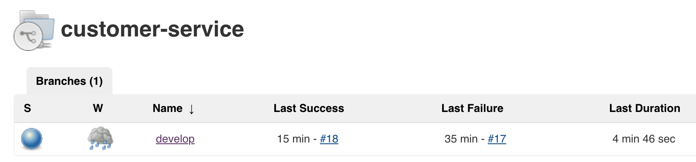
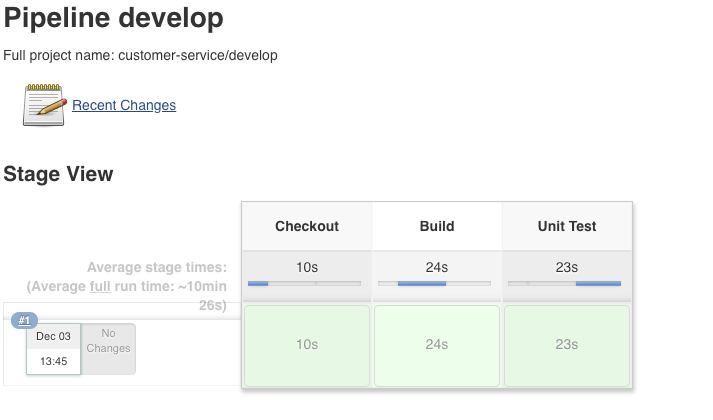

# Exercise 3 - Build Java Pipeline

In this lab, you will create a Jenkins Pipeline Job that checks out a SpringBoot microservice project and builds a JAR archive.

## Create Jenkinsfile for Build

* Sign into the Gogs (top right): <http://gogs.{{ ocp_app_suffix }}> <a href="#"></a>

    * Username: `student-{{ student_number }}` <a href="#"></a>
    * Password: `{{ student_pwd }}` <a href="#"></a>

    >Note: Keep Gogs open in a new tab. You will be returning to make many more updates between Jenkins builds.

* Click on the customer-service repository.

    
    

* Create a new file in the root of the customer-service repository 
   * Select the blue *New file*  button
    
        
    
    
   * Enter file name `Jenkinsfile` 
   * Copy the following contents into the new file:

```

    def app_name = "customer";
    def nexusUrl = "http://nexus-student-{{ student_number }}-cicd.{{ ocp_app_suffix }}";
    def release_number;
      
    // Exercise 6 variable placeholder ...
    
    // Exercise 8 variable placeholder ...
    
    node ("maven-podman") {
    
        stage('Checkout') {
            echo "In checkout"
            checkout scm
    
            if(BRANCH_NAME ==~ /(release.*)/) {
                def tokens = BRANCH_NAME.tokenize( '/' )
                branch_name = tokens[0]
                branch_release_number = tokens[1]
                release_number = branch_release_number
            }
            else {
                sh (
                        script: "mvn -B help:evaluate -Dexpression=project.version | grep -e '^[^\\[]' > release.txt",
                        returnStdout: true,
                        returnStatus: false
                        )
                release_number = readFile('release.txt').trim()
                echo "release_number: ${release_number}"
            }
        }
    
        stage('Build') {
            echo "In Build"
            sh "mvn -s configuration/settings.xml -Dnexus.url=${nexusUrl}  -DskipTests=true -Dbuild.number=${release_number} clean install"
        }
    
        stage ('Unit Test') {
            sh "mvn -s configuration/settings.xml -Dnexus.url=${nexusUrl}  -Dbuild.number=${release_number} test"
            junit "target/surefire-reports/*.xml"
    
            step([$class: 'XUnitBuilder',
                thresholds: [
                    [$class: 'FailedThreshold', unstableThreshold: '1']
                ],
                tools: [
                    [$class: "JUnitType", pattern: "target/surefire-reports/*.xml"]
                ]])
        }
    
        
        // Exercise 4 placeholder ...
        
        // Exercise 5 placeholder ...
        
        // Exercise 6 placeholder ...
        
        // Exercise 7 placeholder ...
        
        // Exercise 8 placeholder ...
        
    }

```

   * At the bottom click the green  *Commit Changes* button

## Configure Jenkins Job to Build Code

* Log into [Jenkins](<http://jenkins-student-{{ student_number }}-cicd.{{ ocp_app_suffix }}>) <a href="#"></a>

    * Username: `student-{{ student_number }}` <a href="#"></a>
    * Password: `{{ student_pwd }}` <a href="#"></a>

* Click on *New Item* (top left).
* Enter the following values:

    * Item Name: `customer-service` <a href="#"></a>
    * and select at the bottom: `Multibranch pipeline`
    * Click *OK*


    

* Click OK to create the customer-service project.

* Under *Branch Sources*, click *Add Source* and select *Git*.

* Enter the following values:

    * Project repository: `http://gogs.{{ ocp_app_suffix }}/student-{{ student_number }}/customer-service.git` <a href="#"></a>


    


* Click the *Save* button.

* This will trigger a build of your develop branch.

    
    

* Navigate to the Jenkins job *develop* to see the status of the build.

  * Go back to Jenkins
  * Select the project *customer-service*:

    
    
    
  * Then select the job *develop* job:  
    
    
    
   
   * The Job should execute three stages; Checkout, Build and Unit Test. 
    
    
    


