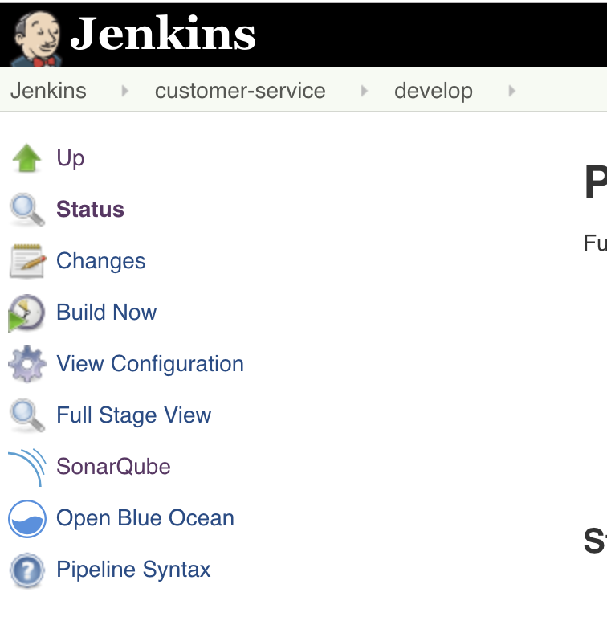

# Exercise 4 - Add Code Analysis
SonarQube analyzes the source code for common issue and test coverage.  In this lab, you will add stages to perform analysis of you code.

Edit the Jenkinsfile for the customer-service project and add the following two stages to the build pipeline after the Unit Test stage.

```
...
	stage ('Unit Test') {
		sh "mvn -s configuration/settings.xml -Dnexus.url=${nexusUrl}  -Dbuild.number=${release_number} test"
		junit "target/surefire-reports/*.xml"

		 tep([$class: 'XUnitBuilder',
			thresholds: [
				[$class: 'FailedThreshold', unstableThreshold: '1']
			],
			tools: [
				[$class: "JUnitType", pattern: "target/surefire-reports/*.xml"]
			]])
	}

	stage('SonarQube Analysis') {
		withSonarQubeEnv('sonar') { sh "mvn -s configuration/settings.xml -Dnexus.url=${nexusUrl} -Dbuild.number=${release_number}  sonar:sonar" }
	}


	stage("Quality Gate"){
		timeout(time: 1, unit: 'HOURS') {
			def qg = waitForQualityGate()
			if (qg.status != 'OK') {
				error "Pipeline aborted due to quality gate failure: ${qg.status}"
			}
		}
	}
...
```

Rebuild Project.

Once complete, notice the SonarQube link on the left navigation.  You can click this to see the results of the analysis.  

