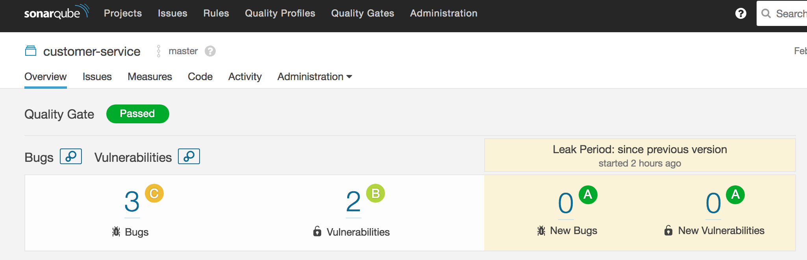

# Exercise 4 - Add Code Analysis
SonarQube analyzes the source code for common issue and test coverage.  In this lab, you will add stages to perform analysis of your code.

* Edit the Jenkinsfile for the *customer-service* project by replacing the *Exercise 4 placeholder*  with the code below. 
  This will add the following two stages to the build pipeline after the *Unit Test* stage:
    * SonarQube Analysis
    * Quality Gate

```
	
	stage('SonarQube Analysis') {
		withSonarQubeEnv('sonar') { sh "mvn -s configuration/settings.xml -Dnexus.url=${nexusUrl} -Dbuild.number=${release_number}  sonar:sonar" }
	}


	stage("Quality Gate"){
		timeout(time: 1, unit: 'HOURS') {
			def qg = waitForQualityGate()
			if (qg.status != 'OK') {
				error "Pipeline aborted due to quality gate failure: ${qg.status}"
			}
		}
	}
	
```

* Rebuild Project:
 
  * Go back to Jenkins
  * Select the project *customer-service*:

    
    
    
  * Then select the job *develop* job:  
    
    
    
    
   * To trigger a build click on the *Build Now* option on the left hand side.  
      
      
    

* Once complete, notice the *SonarQube* link on the left navigation.  
        
    
    

* You can click this to see the results of the analysis.  

      
    