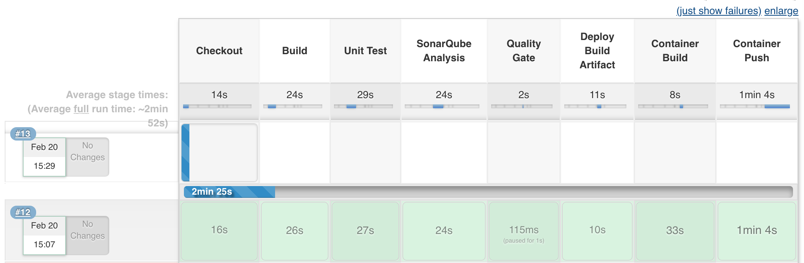

# Exercise 6 - Container Build
Now we are going to build our container and publish it to our enterprise registry (Quay).

We will be using podman to build our container.

* Add the following variables to the top of the Jenkinsfile for the *customer-service* project 
  by replacing the *Exercise 6 variable placeholder*  with the code below:

```

    def imageBase = "quay.{{ ocp_app_suffix }}";
    def imageNamespace = "student_{{ student_number }}";
    def registryUsername = "student-{{ student_number }}";
    def registryPassword = "{{ student_pwd }}";

```

* Add the following steps to the Jenkinsfile by replacing the *Exercise 6 placeholder*  with the code below:

```
    
    def tag = "${release_number}";
    
    if (BRANCH_NAME ==~ /(develop|release.*)/) {		
        stage('Container Build') { 
            sh "podman build -t ${imageBase}/${imageNamespace}/${app_name}:${tag} ." 
        }
        
        stage('Container Push') {
            if (BRANCH_NAME ==~ /(develop|release.*)/) {
                sh "podman login -u ${registryUsername} -p ${registryPassword} ${imageBase}"
                sh "podman push ${imageBase}/${imageNamespace}/${app_name}:${tag}"
            }
        }
    }
	
```

* Rebuild Project by returning to the customer-service develop job and trigger a build.

    
    
    