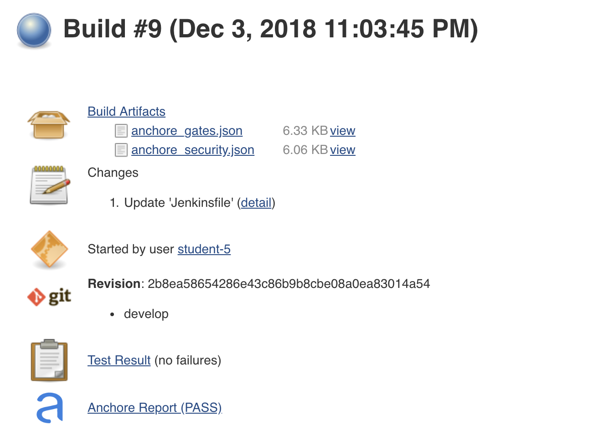

# Exercise 7 - Scan Container Image
In the next step, we will scan the newly created image for issues and known vulnerabilities.   We will be using the Jenkins Anchore Image Scanner for this task.

* Add the following to the Jenkinsfile for the *customer-service* project 
  by replacing the *Exercise 7 placeholder*  with the code below:

```

	if (BRANCH_NAME ==~ /(develop|release.*)/) {		
		stage('Container Scan') {
			writeFile file: 'anchore_images', text: "${imageBase}/${imageNamespace}/${app_name}:${tag} Dockerfile"
			anchore engineRetries: '1000', name: 'anchore_images'
		}
	}
	
```

* Rebuild Project by returning to the customer-service develop job and trigger a build.
* Once complete, you will see the Anchore Report Link associated with the build. 
    
   >Note: This step can take up to 9 minutes to run! 

    