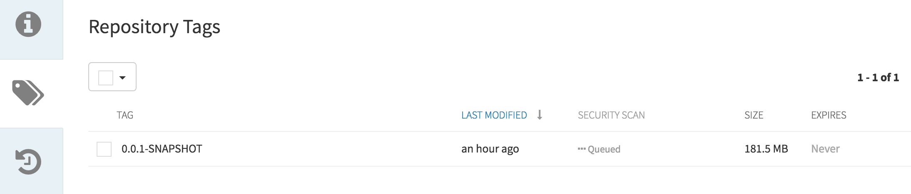

# Exercise 7 - Scan Container Image
In the next step, we will scan the newly created image for issues and known vulnerabilities.   We will be using the Jenkins Anchore Image Scanner for this task.

* Add the following to the end of the Jenkinsfile for the *customer-service* project 
  by replacing the *Exercise 7 placeholder*  with the code below:

```

	if (BRANCH_NAME ==~ /(develop|release.*)/) {		
		stage('Container Scan') {
			writeFile file: 'anchore_images', text: "${imageBase}/${imageNamespace}/${app_name}:${tag} Dockerfile"
			anchore engineRetries: '1000', name: 'anchore_images'
		}
	}
	
```

* Rebuild Project by returning to the customer-service develop job and trigger a build.
* Once complete, you will see the Anchore Report Link associated with the build. 
    
   >Note: This step can take up to 9 minutes to run! 

    
    
    
    
   >Note: New vulnerabilities are found each day. If you are one of the lucky ones and your build failed, 
    click on the *Anchore Report* (FAIL) on the left hand side and see what vulnerabilities were found. To avoid the failure, remove this new code from the Jenkinsfile and rebuild.
 
* Log into the Quay registry: <https://quay.{{ ocp_app_suffix }}> <a href="#0"></a>

    * Username: `student-{{ student_number }}` <a href="#0"></a>
    * Password: `{{ student_pwd }}` <a href="#0"></a>

    >Note: If asked, please confirm username by clicking on the *Confirm Username* button
    
    
    
    
* Click *Repositories* and select the *customer* repository then browse the tags. 
    * Notice the Security Scan tag.  
    * The image is queued for scanning. 
    * Once complete you will see the results of the scan.  

    
       