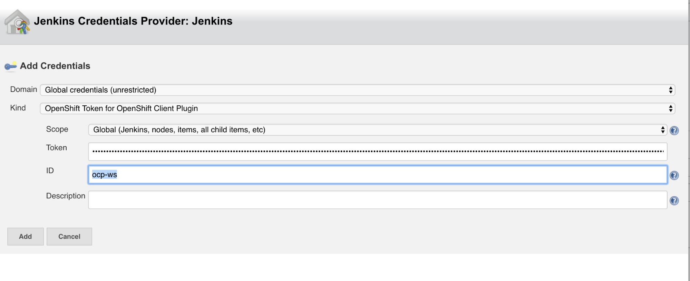
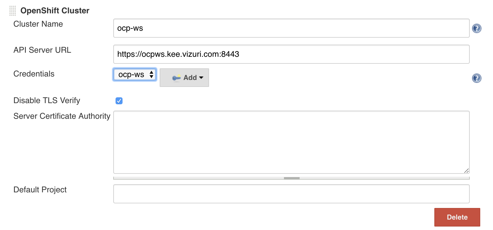
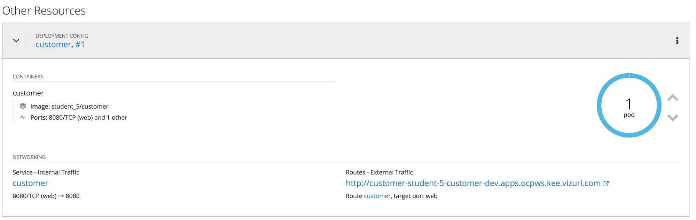

# Exercise 8: Deploy Image to OpenShift
Add configuration to Deploy the image to OpenShift.  
Configure Jenkins OpenShift Client Plugin.  
Get Jenkins Service Account Token from OpenShift to be used by the OpenShift Client Plugin.

* Log into the OpenShift Console: <{{ ocp_console_url }}>
* Navigate to the CICD Project.
* Choose Resources -> Secrets
* Locate one of the two jenkins-token-XXXXX secrets.
* Click to view the secret
* Click on Reveal the Secret to see the values.
* Copy the value of the Token to be used below.

In Jenkins, click on Manage Jenkins -> Configure System.  

Scroll down to the OpenShift Client Plugin Section.   Press the Add OpenShift Cluster button and choose OpenShift Cluster.

Enter the following values:

* Cluster name: ocp-ws
* API Server URL: <{{ ocp_console_url }}>
* Disable TLS Verify: Check
* Credentials: Click Add and Select Jenkins to Create new Credentials.  
	* Kind: OpenShift Token for OpenShift Client Plugin
	* ID: ocp-ws
	* Token: Past token retrieved above.


    

Click Add to create the new credential.

Select the new credential in the credentials drop down.


    

Click Save to update the Jenkins Plugin.

* Update Jenkinsfile by adding the following variables to the top of the Jenkinsfile for the *customer-service* project. 
  Replacing the *Exercise 8 variable placeholder*  with the code below:

```

def ocp_cluster = "ocp-ws"
def ocpDevProject = "student-{{ student_number }}-customer-dev"
def ocpTestProject = "student-{{ student_number }}-customer-test"
def ocpProdProject = "student-{{ student_number }}-customer-prod"

```

* Add the following code to the bottom of the Jenkinsfile by replacing the *Exercise 8 placeholder*  with the code below:


```

	if (BRANCH_NAME ==~ /(develop)/) {
		def ocp_project = ocpDevProject;
		stage("Deploy Openshift ${ocp_project}") {
			openshift.withCluster( "${ocp_cluster}" ) {
				openshift.withProject( "${ocp_project}" ) {
					def dc = openshift.selector("dc", "${app_name}")
					if(!dc.exists()) {
						dc = openshift.newApp("-f https://raw.githubusercontent.com/Vizuri/openshift-cicd-pipeline/master/templates/springboot-dc.yaml -p IMAGE_NAME=${imageBase}/${imageNamespace}/${app_name}:${tag} -p APP_NAME=${app_name} -p DATABASE_HOST=customerdb -p DATABASE_DB=customer -p DATABASE_USER=customer -p DATABASE_PASSWORD=customer").narrow("dc")
					}
					else {
						def dcObject = dc.object()
						dcObject.spec.template.spec.containers[0].image = "${imageBase}/${imageNamespace}/${app_name}:${tag}"
						openshift.apply(dcObject)
					}

					def rm = dc.rollout()
					rm.latest()
					timeout(5) {
						def latestDeploymentVersion = openshift.selector('dc',"${app_name}").object().status.latestVersion
						def rc = openshift.selector('rc', "${app_name}-${latestDeploymentVersion}")
						rc.untilEach(1){
							def rcMap = it.object()
							return (rcMap.status.replicas.equals(rcMap.status.readyReplicas))
						}
					}
				}
			}
		}
    }
    

```

* Rebuild Project by returning to the customer-service develop job and trigger a build.

* Once finished, you can log into OpenShift and navigate to the Customer Development project.  You should now have a customer POD running. 


    
