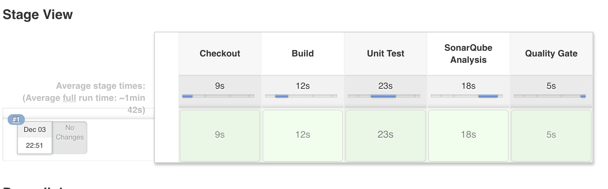

# Exercise 9 - Full Pipeline From Shared Library
In this lab, you will build a complete CI/CD pipeline.  It builds Feature, Develop and Release Branch Jobs and Orchestrates a release from Dev->Test->Prod.
Review Pipeline Library Functions.
Browse openshift-cicd-pipeline github repository. 

<https://github.com/Vizuri/openshift-cicd-pipeline>

Navigate to src -> com -> vizuri -> openshift.

Review the functions in PipelineSteps.groovy.

Next review the Pipeline defined in JavaDeliveryPipeline.groovy.

Update Jenkinsfile

Now back your Jenkinsfile to Jenkinsfile.BAC.

Update the Jenkins File with the following contents.

```
#!/usr/bin/groovy
@Library('github.com/vizuri/openshift-cicd-pipeline@master')

def javaDeliveryPipeline = new com.vizuri.openshift.JavaDeliveryPipeline();


javaDeliveryPipeline {
	ocpAppSuffix = 'apps.ocpws.kee.vizuri.com'
	imageNamespace = 'student_{{ student_number }}';
	registryUsername = 'student-{{ student_number }}'
	imageBase = 'quay.{{ ocp_app_suffix }}'
	registryUsername = 'student-{{ student_number }}'
	registryPassword = '{{ student_pwd }}'
	app_name = 'customer'
	ocp_dev_cluster = 'ocp-ws'
	ocp_dev_project = 'student-{{ student_number }}-customer-dev'
	ocp_test_cluster = 'ocp-ws'
	ocp_test_project = 'student-{{ student_number }}-customer-test'
	ocp_prod_cluster = 'ocp-ws'
	ocp_prod_project = 'student-{{ student_number }}-customer-prod'
}
```

Configure Gogs Jenkins WebHook
Log into Gogs

<http://gogs.{{ ocp_app_suffix }}>

* Username: student-{{ student_number }}
* Password: {{ student_pwd }}

Select the customer-service project.

Click on the Settings link in the top right.

Choose Webhooks.

Click Add Webhook and select Gogs.

Enter the following values.

* Payload URL: http://jenkins-student-{{ student_number }}-cicd.{{ ocp_app_suffix }}/gogs-webhook/?job=customer-service

Click Save.

Test Feature Branch
Create a new branch called feature/Feature-1 in the Gogs Repository.

Watch build trigger a new Feature build.

The following steps will be executed.



Test Develop Branch
Create a Pull Request and merge the Feature Branch into the Develop Branch.

This will trigger the Develop branch build and deploy to development.

Release Develop Branch
Create a release branch called release/1.0

This will trigger a release pipeline
