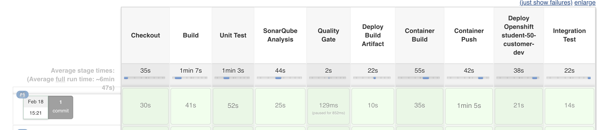
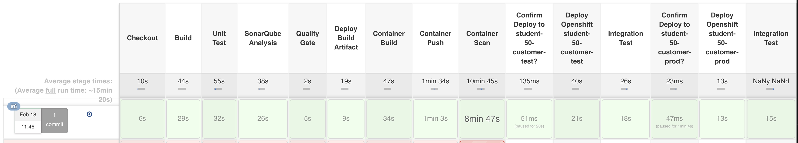
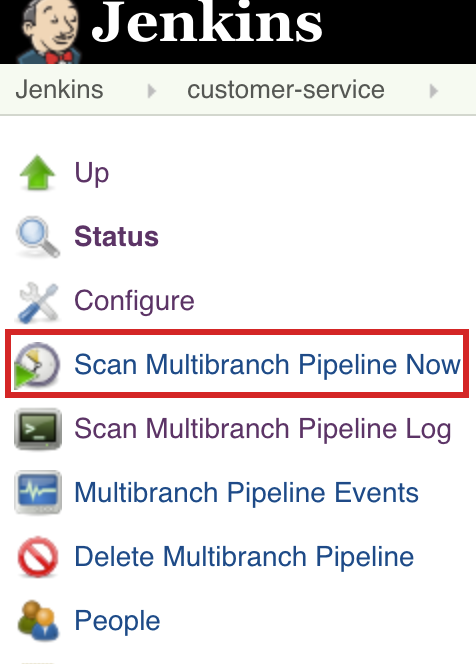

# Exercise 9 - Putting it all together
In this lab, you will build a complete CI/CD pipeline utilizing a shared function library and declaring a reusable delivery pipeline passing in input parameters.  

You can view the shared function library here:
<https://github.com/Vizuri/openshift-cicd-pipeline/blob/master/src/com/vizuri/openshift/PipelineSteps.groovy>

You can view the reusable delivery pipeline here:
<https://github.com/Vizuri/openshift-cicd-pipeline/blob/master/src/com/vizuri/openshift/JavaDeliveryPipeline.groovy>

This reusable pipeline supports a Feature, Develop and Release Branch.

If the branch starts with feature/..., a featue pipeline is executed.
This just builds and performs code analysis of the feature branch code.

    

If the branch is develop, a development pipeline is executed.
This builds the code, performs code analysis, pushes the build artifact to nexus, builds a container, pushes it to a quay registry, deploys the container to an openshift development project and then run integratino tests on the deployed code.

    

If the branch starts with release/..., a release pipeline is executed.
This builds the code, performs code analysis, pushes the build artifact to nexus, builds a container, pushes it to a quay registry, prompts the user to confirm deployment to test, deploys the container to an openshift test project, run integratino tests aginst test, promps the user to confirm a deployment to production, depoys the container to production and then runs integration tests against projection.

    

## Test Shared Library

* Backup your Jenkinsfile to Jenkinsfile.BAC.
* Update the Jenkins File by replacing everything with the following contents:

```

    #!/usr/bin/groovy
    @Library('github.com/vizuri/openshift-cicd-pipeline@master')
    
    def javaDeliveryPipeline = new com.vizuri.openshift.JavaDeliveryPipeline();
    
    
    javaDeliveryPipeline {
        ocpAppSuffix = 'apps.ocpws.kee.vizuri.com'
        imageNamespace = 'student_{{ student_number }}';
        registryUsername = 'student-{{ student_number }}'
        imageBase = 'quay.{{ ocp_app_suffix }}'
        registryUsername = 'student-{{ student_number }}'
        registryPassword = '{{ student_pwd }}'
        app_name = 'customer'
        ocp_dev_cluster = 'ocp-ws'
        ocp_dev_project = 'student-{{ student_number }}-customer-dev'
        ocp_test_cluster = 'ocp-ws'
        ocp_test_project = 'student-{{ student_number }}-customer-test'
        ocp_prod_cluster = 'ocp-ws'
        ocp_prod_project = 'student-{{ student_number }}-customer-prod'
    }

```

### Test Feature Branch
Create a new branch feature branch and test it in Jenkins:

   * Create a new branch called `feature/Feature-1` in the Gogs Repository.  
   * From the Jenkins console, click on the *Scan Multibranch Pipeline Now* link on the left. This will scan the project for new branches and kick off the feature branch build.  

     >Note that in practice a webhook should be configured to automatically trigger the build when a new branch is created. 

    

### Test Develop Branch
Create a Pull Request and merge the Feature Branch into the Develop Branch.   

* Click on *Scan Multibranch Pipeline Now* link on the left.  This will trigger the develop branch build.

### Release Develop Branch
Create a release branch called release/1.0 from the develop branch.  
* Cick on *Scan Multibranch Pipeline Now* button.  This will trigger the develop branch build.  WHen prompted choose "Proceed" to deploy container to test and production environments.  

